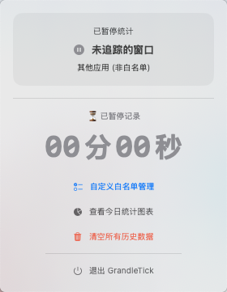

# GrandleTick

GrandleTick 是一个我自用的 `macOS` 菜单栏学习计时工具，现在免费开源出来。

这个项目最初是为了考研时统计有效学习时间写的，重点解决两类场景：

- 在 `Bilibili` 看课程视频
- 在 macOS `预览`（Preview）中阅读 `PDF`

它不是通用型时间管理软件，也不是跨平台产品，定位就是一个偏个人工作流的轻量工具：自动、少打扰、只统计我关心的学习行为。

## 项目特点

- 菜单栏常驻运行，随时查看当前任务时长
- 自动追踪 `Bilibili` 视频学习时间
- 自动追踪 `预览` App 中 `PDF` 的阅读时间
- 仅统计白名单内的应用和网站，切到其他窗口会自动暂停
- 支持自定义应用白名单和域名白名单
- 支持查看今日统计图表和历史汇总
- 支持删除单条历史记录，也支持一键清空全部数据
- 数据本地存储在 `Application Support/GrandleTick`，不依赖云端
- 内置旧版数据库迁移逻辑，更新后可自动迁移历史记录

## 当前实现

### 1. 菜单栏计时

应用以 `MenuBarExtra` 形式运行：

- 菜单栏显示当前任务今日累计时长
- 展开后可看到当前窗口的历史累计时长
- 当前未命中白名单时，会显示“已暂停统计”

### 2. 浏览器追踪

目前支持：

- `Safari`
- `Google Chrome`
- `Microsoft Edge`

程序会读取当前浏览器标签页地址，并结合白名单域名决定是否计时。

其中对 `Bilibili` 做了额外处理：

- 会从 URL 中提取 `BV` / `ep` 标识
- 尽量按同一视频聚合统计，减少因标题变化导致的重复拆分
- 未命中域名白名单的网页不会被记录

### 3. PDF 追踪

当你在 macOS `预览` App 中阅读 PDF 时，程序会读取当前窗口标题，并按 PDF 文件名聚合统计时长。

### 4. 白名单机制

默认白名单包含一些应用和域名，另外也支持手动扩展：

- 应用白名单可通过文件选择器添加
- 域名白名单可手动输入
- 浏览器记录会优先按真实域名过滤和分组

这意味着它不只是能统计 `Bilibili`，也能统计你主动加入白名单的学习网站；只是这个项目最初的核心使用场景是 `Bilibili + 预览 PDF`。

### 5. 统计与历史记录

项目内置统计页面，支持：

- 查看今日活动总结
- 按应用或域名汇总时长
- 查看每个分类下的具体条目
- 删除某条明细记录

## 适合的使用场景

如果你的学习过程主要像下面这样，这个项目会比较合适：

- 跟着 B 站网课学习
- 在 `预览` 里看讲义、真题、笔记 PDF
- 希望自动记录时间，而不是手动开关计时器

## 安装与使用

普通用户推荐直接下载 `Release` 中打包好的 `GrandleTick.app`，不需要安装 `Xcode`。

1. 从 GitHub `Release` 下载最新版本
2. 将 `GrandleTick.app` 拖到 `/Applications`
3. 如果系统提示 “App 已损坏，打不开”，执行：

```bash
sudo xattr -cr /Applications/GrandleTick.app
```

4. 再次打开 `GrandleTick.app`
5. 首次启动后授予 App “辅助功能权限”
6. 保持菜单栏程序运行
7. 打开白名单内的应用或网页后，程序会自动开始统计

如果你是开发者，才需要使用 `Xcode` 打开项目自行编译运行。

## 使用截图

下面是 `GrandleTick` 菜单栏弹窗的实际运行界面：



## 权限说明

项目依赖 `辅助功能权限` 来读取当前前台应用、窗口标题和部分浏览器信息，否则无法正常工作。

系统路径：

`系统设置 -> 隐私与安全性 -> 辅助功能`

## 数据存储

应用数据保存在本地：

- 数据目录：`~/Library/Application Support/GrandleTick`
- 数据库文件：`ActivityData.sqlite`

不会上传到服务器，也没有联网依赖。

## 限制

- 只支持 `macOS`
- PDF 统计目前只支持系统自带 `预览` App
- 浏览器统计依赖白名单域名，不在白名单中的网页不会记录
- 这个项目以我自己的学习工作流为中心设计，功能边界比较明确

## 开源说明

这是一个个人自用项目的公开分享版本，代码保持“够用优先”的风格，主要服务于我自己的学习记录需求。

如果你的场景和我接近，可以直接拿去用；如果你想扩展到更多网站、更多阅读器，或者做成更通用的时间追踪器，也可以在此基础上继续改。

## 常见问题

### 提示“App 已损坏，打不开”

如果你是从 `Release` 下载的打包版本，系统提示“已损坏”，可以执行：

```bash
sudo xattr -cr /Applications/GrandleTick.app
```
