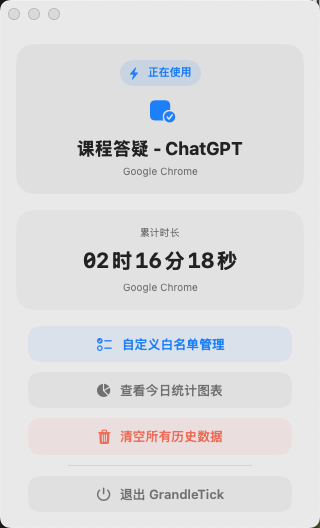
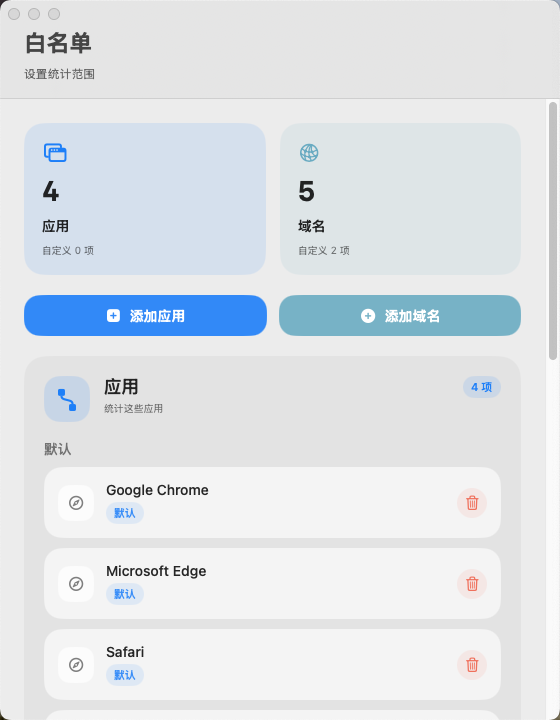

# GrandleTick

GrandleTick 是一个 `macOS` 菜单栏学习计时工具。

它适合这种使用方式：

- 在 `Bilibili` 看课程
- 在 `预览` 里读 `PDF`
- 偶尔配合一些学习网站
- 希望自动记录，而不是手动开关计时器

它不是通用型时间管理软件，也不是待办工具。它更像一个安静的学习记录器：只在你设定的范围内统计时间，尽量少打扰。

## 能做什么

- 常驻菜单栏，随时看到当前累计时长
- 自动统计 `PDF` 阅读时间
- 自动统计白名单网站的学习时间
- 支持 `Safari`、`Google Chrome`、`Microsoft Edge`
- 支持自定义应用白名单和网站白名单
- 支持按 `今天 / 最近7天 / 最近30天 / 全部历史` 查看统计
- 支持趋势图、当日明细、总排行
- 支持搜索和筛选
- 支持删除单条记录
- 支持一键清空全部历史数据
- 数据只保存在本地，不上传服务器

## 适合谁

如果你的学习流程接近下面这些场景，这个软件会比较顺手：

- 跟着 B 站网课学习
- 在 `预览` 里看讲义、笔记、真题
- 想知道自己这周到底学了多久
- 想看某一天具体学了什么
- 不想每次学习前都手动点开始计时

## 软件功能

### 菜单栏计时

应用启动后会常驻在菜单栏：

- 菜单栏显示今日累计时长
- 点开后可以看到当前正在统计的内容
- 如果当前窗口不在统计范围内，会自动暂停

### 自动统计

目前主要支持两类内容：

- `PDF`
  在 macOS 自带的 `预览` App 中阅读时自动计时

- 浏览器中的学习内容
  只统计白名单中的网站

对于 `Bilibili`，软件会尽量把课程内容和普通娱乐内容区分开来，减少娱乐视频被算进学习时间的情况。

### 统计页面

统计页支持：

- 看今天、最近 7 天、最近 30 天或全部历史
- 看每天的时长变化
- 点某一天查看当天明细
- 从 `应用 / 域名 / PDF` 三个角度看记录
- 查看总排行
- 用搜索和筛选快速收窄结果

## 安装

普通用户推荐直接下载打包好的 `GrandleTick.app`。

1. 从 GitHub `Release` 下载最新版本
2. 将 `GrandleTick.app` 拖到 `/Applications`
3. 如果系统提示“App 已损坏”，执行：

```bash
sudo xattr -cr /Applications/GrandleTick.app
```

4. 再次打开 `GrandleTick.app`
5. 首次启动后授予“辅助功能权限”

如果你是开发者，也可以直接用 `Xcode` 打开项目自行编译。

## 使用方法

1. 启动应用
2. 打开菜单栏图标
3. 先检查白名单，把你要统计的应用和网站加进去
4. 正常学习即可，软件会自动记录
5. 需要回顾时，打开统计页查看趋势和明细

## 界面预览

以下截图使用演示数据生成，不包含真实个人记录。

### 菜单栏



### 白名单管理



### 统计页面


## 数据与隐私

所有数据都保存在本地：

- 数据目录：`~/Library/Application Support/GrandleTick`
- 数据库文件：`ActivityData.sqlite`

不会上传到服务器。

## 当前边界

- 只支持 `macOS`
- `PDF` 目前只支持系统自带的 `预览`
- 浏览器内容需要命中白名单才会统计
- `Bilibili` 的学习 / 娱乐区分已经做了专门处理，但仍然不是百分之百准确
- 这个项目围绕个人学习工作流设计，不是面向所有场景的通用追踪器

## 常见问题

### 为什么我打开了网页，但没有开始统计？

通常是下面几种原因：

- 当前网站不在白名单内
- 当前浏览器不在白名单内
- 没有授予辅助功能权限
- 当前页面被识别为不在统计范围内

### 提示“App 已损坏，打不开”

如果你是从 `Release` 下载的打包版本，可以执行：

```bash
sudo xattr -cr /Applications/GrandleTick.app
```

### 统计的数据会同步到云端吗？

不会。当前版本只做本地存储。

## 说明

这是一个从我自己的学习需求里长出来的小工具，现在把它开源出来。

如果你的学习方式和我接近，可以直接拿来用；如果你想继续扩展更多网站、更多阅读器，或者改成更通用的记录工具，也可以在这个基础上继续改。
